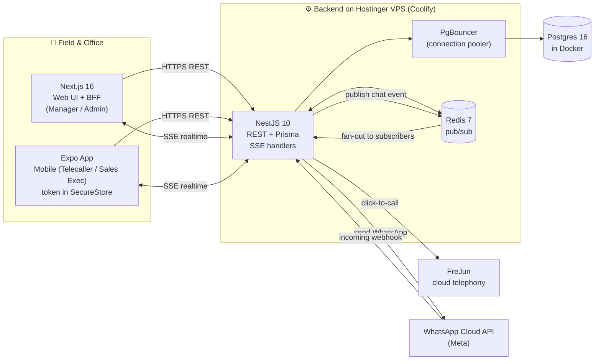
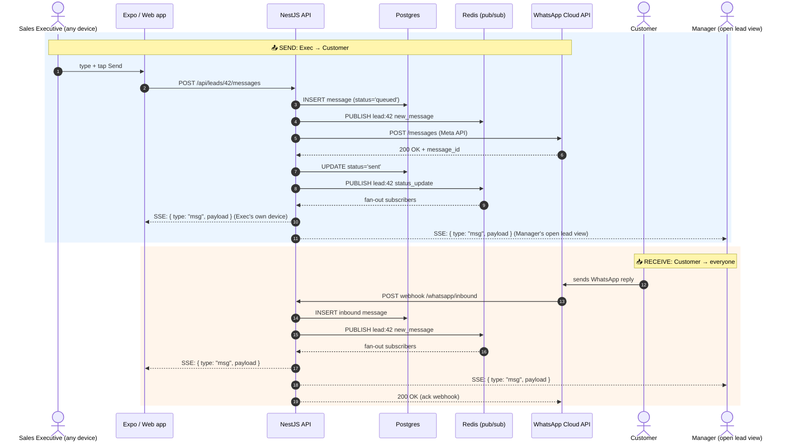
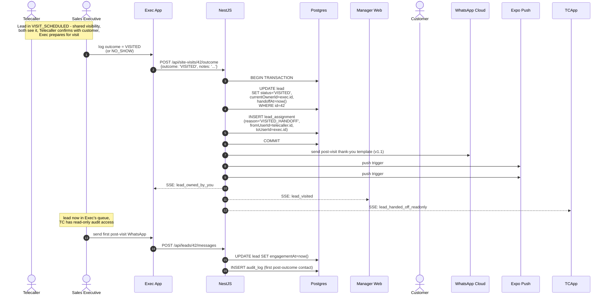

# Shadhil Builders CRM - How It Works

A picture-book guide for Shadhil's sales leadership. Six diagrams, plain English, no jargon walls. Each diagram appears twice: once in plain text (so it reads in any terminal or email) and once in Mermaid format (so it renders nicely on GitHub or the company wiki).

**Reading guide.** The little arrows are: `→` "goes to", `↓` "feeds into", `⇢` "publishes a message". The actors (people, apps, services) are in `boxes`. Steps that happen automatically (no human clicking) are tagged `(auto)`.

---

## Diagram 1 - The Big Picture: All Our Apps and Where Data Lives

**ELI10.** Think of the CRM as a small office with three front desks and one filing cabinet. The *web app* is the desk a Sales Manager uses on a laptop. The *mobile app* is the desk a Telecaller carries in their pocket. The *backend* is the clerk behind the scenes who actually files things. All three desks talk to the same clerk, who writes everything into a big locked filing cabinet (the database). When the clerk wants to "shout" a message to anyone who has a file open right now, he shouts through a little intercom (Redis), and messages on WhatsApp flow in and out through a special phone line (the WhatsApp Cloud API). Phone calls flow through FreJun, our Indian cloud phone system.

```
                                                                                ┌──────────────────┐
                                                                                │  FreJun (cloud   │
                                                                                │  telephony, India)│
                                                                                └────────┬─────────┘
                                                                                         │ calls
                                                                                         ▼
┌──────────────────┐      HTTPS (REST)      ┌──────────────────┐    SQL     ┌──────────────┐
│  Next.js 16      │ ────────────────────▶  │   NestJS 10      │ ─────────▶ │  PgBouncer   │
│  (Web UI + BFF)  │                        │   (Backend)      │            │  (pooler)    │
│  Sales Manager   │                        │                  │            └──────┬───────┘
│  + Admin on laptop│ ◀──── SSE stream ──── │   Prisma ORM     │                   │
└──────────────────┘                        │                  │                   ▼
                                           └────┬─────────────┘            ┌──────────────┐
                                                 │                          │  Postgres 16 │
┌──────────────────┐      HTTPS (REST)            │                          │  (the one    │
│  Expo (Mobile)   │ ────────────────────────────▶│                          │  source of   │
│  Telecaller +    │ ◀──── SSE stream ─────────── │                          │  truth)      │
│  Sales Exec in   │      token in SecureStore    │                          └──────────────┘
│  the field       │                              │
└──────────────────┘                              │ Redis pub/sub (intercom)
                                           ┌──────▼─────────────┐
                                           │      Redis 7       │
                                           │  (pub/sub for SSE) │
                                           └────────────────────┘

                                                 ▲
                                                 │ webhook (incoming WhatsApp)
                                                 │
                                          ┌──────┴──────────┐
                                          │  WhatsApp Cloud │
                                          │  API (by Meta)  │
                                          └─────────────────┘

All three apps are deployed via Coolify on a Hostinger VPS in India.
```



**Note.** Everything important sits in Postgres - Redis is only for "who is online, push them this chat message *now*". Losing Redis never loses a lead. Both apps share the same NestJS backend, so a Sales Manager's laptop and a Telecaller's phone always see the same data within a second of each other.

---

## Diagram 2 - Logging In From a Laptop (Web)

**ELI10.** Imagine Priya the Sales Executive walks up to the office door (opens her browser). She shows her ID (email + password) to the guard at the front desk (Next.js, which is also doing login). The guard checks her ID, gives her a little wristband (an encrypted cookie) so she doesn't have to show ID at every desk, and gives her a stamped pass (a JWT token) she can show to the back-office clerk (NestJS). Every time she asks the clerk for a file, the clerk checks the pass *and* the filing cabinet has a built-in lock that only opens files for people with the right pass - even if the clerk makes a mistake, the cabinet itself refuses to show her files she shouldn't see.

```
Step  Actor              Action
─────  ───────────────── ────────────────────────────────────────────────────────
 1.   Sales Executive    Opens browser, goes to app.shadhil.com/login
 2.   Browser            Types email + password, clicks "Sign in"
 3.   Next.js BFF        better-auth checks email + password against Postgres
 4.   Next.js BFF        Sets httpOnly secure cookie (session) in browser
 5.   Next.js BFF        Mints a short-lived JWT signed with HM256 secret
 6.   Browser            Stores JWT in memory; cookie auto-attaches on every req
 7.   Browser            Calls GET /api/leads  →  Next.js proxies to NestJS
                          sending cookie + Authorization: Bearer <jwt>
 8.   NestJS             Middleware verifies JWT, sets Postgres session vars
                          (app.current_user_id, app.current_user_role)
                          Postgres RLS filters rows → returns only Priya's leads
```

```mermaid
sequenceDiagram
    autonumber
    actor Priya as Sales Executive (browser)
    participant Web as Next.js BFF
    participant Auth as better-auth (in Next.js)
    participant Nest as NestJS API
    participant DB as Postgres (with RLS)

    Priya->>Web: Open /login, type email + password
    Web->>Auth: validate credentials
    Auth->>DB: SELECT user WHERE email = ? AND password_hash = ?
    DB-->>Auth: user row (or null)
    Auth-->>Web: session = valid
    Web-->>Priya: Set-Cookie: session=<httpOnly, secure>
    Web-->>Priya: also returns JWT in response body
    Priya->>Nest: GET /api/leads  (cookie + Bearer JWT)
    Nest->>Nest: middleware verifies JWT signature
    Nest->>DB: SET LOCAL app.current_user_id = 'priya-uuid';<br/>SET LOCAL app.current_user_role = 'sales_exec'
    Nest->>DB: SELECT * FROM leads  (RLS policy filters rows)
    DB-->>Nest: only leads Priya owns
    Nest-->>Priya: 200 OK [ her leads only ]
```

**Note.** Two layers of security, on purpose. The cookie handles "is this a real logged-in user?" and the JWT handles "what's the user's role + team so we can tell Postgres who is asking". The RLS policy is the last wall - even if a developer writes a buggy query that forgets to add a `WHERE owner_id = ?`, the database still refuses to leak other people's leads.

---

## Diagram 3 - Logging In From a Phone (Expo Mobile)

**ELI10.** Same idea as the laptop login, but the "wristband" can't be an httpOnly cookie on a phone - phones don't send cookies back the same way browsers do. Instead, after the front desk (Next.js) checks Ravi the Telecaller's ID, Ravi's phone tucks the stamped pass (JWT) into the phone's *hardware safe* - on iPhones that's the secure Keychain chip, on Android that's the encrypted shared-preferences vault. Every time the app calls the back office, it pulls the pass out of the safe and shows it. If Ravi loses his phone, the safe is encrypted and locked, so nobody can read the pass.

```
Step  Actor              Action
─────  ───────────────── ────────────────────────────────────────────────────────
 1.   Sales Executive    Opens Expo app on iOS / Android
 2.   App                Shows Login screen (Expo Router)
 3.   App                User types email + password
 4.   Expo app           @better-auth/expo POSTs to /api/auth/sign-in on Next.js
 5.   Next.js BFF        better-auth validates credentials against Postgres
 6.   Next.js BFF        Returns JWT in JSON response (no cookie - mobile)
 7.   Expo app           @better-auth/expo stores JWT in SecureStore
                          ├─ iOS:     writes to Keychain (hardware-backed)
                          └─ Android: writes to EncryptedSharedPreferences
 8.   App → NestJS       Every fetch() reads JWT from SecureStore, sends
                          Authorization: Bearer <jwt>
                          NestJS verifies, sets session vars, RLS filters rows
```

```mermaid
sequenceDiagram
    autonumber
    actor Ravi as Sales Executive (phone)
    participant Expo as Expo App (React Native)
    participant Store as SecureStore<br/>(iOS Keychain / Android EncryptedSharedPrefs)
    participant Web as Next.js BFF
    participant Nest as NestJS API
    participant DB as Postgres (with RLS)

    Ravi->>Expo: Open app, tap "Sign in"
    Expo->>Web: POST /api/auth/sign-in  {email, password}
    Web->>DB: validate credentials
    Web-->>Expo: { token: <jwt>, user: {...} }
    Expo->>Store: SecureStore.setItem("auth_token", jwt)
    Note over Store: iOS → Keychain (hardware)<br/>Android → EncryptedSharedPreferences
    Ravi->>Expo: open "My Leads" screen
    Expo->>Store: SecureStore.getItem("auth_token")
    Store-->>Expo: jwt
    Expo->>Nest: GET /api/leads  Authorization: Bearer <jwt>
    Nest->>Nest: verify JWT
    Nest->>DB: SET LOCAL app.current_user_id = ... ; role = sales_exec
    Nest->>DB: SELECT * FROM leads  (RLS filters)
    DB-->>Nest: Ravi's leads
    Nest-->>Expo: 200 OK [ leads ]
```

**Note.** The single biggest difference from the web flow: there is no cookie on mobile. The phone holds the JWT in a hardware-encrypted store, and the app attaches it manually on every API call. That's why we use `SecureStore` (not `AsyncStorage` - that one is plain-text and would leak tokens if the phone is compromised). If a user logs out, `SecureStore.deleteItem` wipes the entry from the secure store immediately.

---

## Diagram 4 - A Lead's Life: From "New" to "Booked" (or "Lost") - Model C

**ELI10 (v3.1, Model C).** Every potential buyer (a "lead") starts as a brand-new piece of paper on a Telecaller's desk. The Telecaller chats on WhatsApp, learns what the person wants, and books a site visit. From `NEW` through `VISIT_SCHEDULED`, the Telecaller owns the lead - they are responsible for confirming with the customer 24 hours and 2 hours before the visit. The Sales Executive appears on the lead only once it's `VISIT_SCHEDULED`, so they can prepare for the visit. Then there is a single clean handoff: the moment the visit outcome is logged, ownership transfers automatically. `VISITED` → ownership moves to the Sales Executive. `NO_SHOW` → ownership reverts back to the Telecaller (they have to re-engage and reschedule). After two no-shows in a row, the lead goes cold and the Manager is notified.

```
TELECALLER LANE  (first touch, qualifying, confirming visit)
═══════════════════════════════════════════════════════════════════════════════

   ┌─────┐   ┌──────────┐   ┌─────────────────┐   ┌─────────────────┐
   │ NEW │──▶│CONTACTED │──▶│VISIT_REQUESTED  │──▶│VISIT_SCHEDULED  │
   └─────┘   └──────────┘   └─────────────────┘   └─────────────────┘
     ▲            ▲                  │                     │  ▲
     │            │                  │                     │  │
   lead         first             customer               │  │ shared
   created    WhatsApp              says yes               │  │ visibility
                                                        │  │ (both lanes)
═══════════════════════════════════════════════════════════════════════════════
SALES EXECUTIVE LANE  (conducts visit, closes)            │  │
─────────────────────────────────────────────────────────────▼──┘
                                                          │
                                            (exec appears here, lead in
                                             BOTH queues during
                                             VISIT_SCHEDULED - exec
                                             prepares, telecaller
                                             confirms)
                                                          │
   ┌──────────┐   ┌─────────────────┐   ┌─────────────────┐
   │ VISITED  │◀──│ (outcome logged │──▶│   NO_SHOW       │──▶ re-engage
   └────┬─────┘   │  by exec on the │   └─────────────────┘    (telecaller
        │         │  day of visit)  │     ▲                   owns again)
        │         └─────────────────┘     │
        │                                 │
        ▼                            2nd consecutive
   ┌──────────────┐   ┌──────────────┐  NO_SHOW within
   │ NEGOTIATION  │──▶│BOOKING_      │  14 days
   └──────┬───────┘   │INITIATED     │     │
          │           └──────┬───────┘     ▼
          │                  │      ┌──────────────┐
          │                  │      │  RNR         │──▶ Manager reviews,
          │                  │      └──────────────┘    re-engage or LOST
          ▼                  ▼
       ┌──────┐          ┌──────┐
       │ WON  │          │ LOST │
       └──────┘          └──────┘
```

```
HANDOFF POINT (the only one - automatic on visit outcome)
═══════════════════════════════════════════════════════════

   VISIT_SCHEDULED ──┬── outcome = VISITED ──▶ ownership → Sales Exec
                     │                            (ManagerAssignmentRule picks
                     │                             the exec, default = the
                     │                             exec on SiteVisit.salesExecId)
                     │
                     └── outcome = NO_SHOW  ──▶ ownership → Telecaller
                                                  (auto WhatsApp + push to
                                                   customer + push to telecaller
                                                   + notification to manager)

   No manual handoff button. No manager approval. No two-step routing.
   The handoff is a single, automatic state transition on a concrete event.
```

```mermaid
stateDiagram-v2
    direction LR
    [*] --> NEW : lead created (webhook / manual)

    state "TELECALLER LANE (owns through visit)" as TC {
        NEW --> CONTACTED : first WhatsApp sent
        CONTACTED --> VISIT_REQUESTED : customer says yes to visit
        VISIT_REQUESTED --> VISIT_SCHEDULED : Telecaller picks date, exec assigned
    }

    state "SHARED VISIBILITY (both lanes see lead)" as Shared {
        VISIT_SCHEDULED --> VISIT_SCHEDULED : Telecaller confirms, Exec prepares
    }

    state "SALES EXECUTIVE LANE (conducts visit, owns after)" as SE {
        VISIT_SCHEDULED --> VISITED : customer showed up (auto handoff to exec)
        VISIT_SCHEDULED --> RESCHEDULED : customer asks new date (lead stays with exec)
        VISIT_SCHEDULED --> NO_SHOW : 2h past start, no check-in (auto reverts to telecaller)
        VISITED --> NEGOTIATION : discussion started
        NEGOTIATION --> BOOKING_INITIATED : token / agreement drafted
        BOOKING_INITIATED --> WON : payment cleared
    }

    state "REVERT (telecaller owns again)" as TC2 {
        NO_SHOW --> VISIT_SCHEDULED : telecaller re-engages, reschedules
    }

    NO_SHOW --> RNR : 2nd NO_SHOW within 14 days (auto)
    RNR --> LOST : (auto, after 14 days no reply)
    RNR --> VISIT_SCHEDULED : Manager decides to re-engage

    RESCHEDULED --> VISIT_SCHEDULED : new date picked

    NEGOTIATION --> LOST : customer backs out
    BOOKING_INITIATED --> LOST : customer cancels
    WON --> [*]
    LOST --> [*]
```

**Note (v3.1, Model C).** The handoff is automatic on the visit outcome - there is no Telecaller click, no Manager approval, no Sales Executive claiming. Three enforcement layers:

1. **API:** `POST /api/site-visits/:id/outcome` updates `Lead.status` and `Lead.currentOwnerId` in a single Postgres transaction. The exec must be the one logging `VISITED` (telecaller can only log `NO_SHOW`).
2. **Postgres RLS:** `lead_exec_select` and `lead_telecaller_select` policies both allow reading when `status = 'VISIT_SCHEDULED'` (shared visibility), then narrow on visit outcome.
3. **Audit:** `LeadAssignment` row is written on every ownership change with `reason` = `VISITED_HANDOFF` or `NO_SHOW_REVERT`. Six months later, you can answer "how many handoffs did Exec P. receive last month?" in one SQL query.

The 2-hour no-show WhatsApp (`missed_visit_followup` template) fires automatically via NestJS cron - no human in the loop.

---

## Diagram 5 - Live Chat: How a WhatsApp Message Reaches Everyone in Real Time

**ELI10.** When a Sales Executive types a WhatsApp message in the app, here's what happens in 200 milliseconds: the app sends the message to the back office (NestJS), the back office writes a copy into the filing cabinet (Postgres), and the back office shouts into the office intercom (Redis) "new message for lead #42!" Every device that has lead #42 open at that moment - the Executive's own phone (so they see their message marked "sent"), the Manager's laptop (peeking at the same lead), and a second phone the Executive left open - hears the shout and updates the chat instantly. Customer replies come back the same way, but in reverse: WhatsApp calls our back office on a webhook, the clerk writes the message down and shouts into the intercom, and every open device updates.

```
SENDING (Sales Exec → Customer)
═══════════════════════════════════════════════════════════════════════════════

 Sales Exec    Expo/Next.js        NestJS              Postgres      Redis        WhatsApp
  phone /      web app             backend             (truth)      (intercom)    Cloud API
  laptop
    │  POST /api/leads/42/messages  │                     │              │              │
    │──────────────────────────────▶│                     │              │              │
    │                               │ INSERT message      │              │              │
    │                               │────────────────────▶│              │              │
    │                               │  PUBLISH lead:42    │              │              │
    │                               │────────────────────────────────────▶│              │
    │                               │                                     │              │
    │                               │ POST /messages (Meta API)                          │
    │                               │─────────────────────────────────────────────────────▶
    │                               │                                          200 OK     │
    │                               │◀─────────────────────────────────────────────────────
    │                               │ UPDATE status = 'sent'│              │              │
    │                               │────────────────────▶│              │              │
    │                               │   PUBLISH lead:42 (status update)   │              │
    │                               │────────────────────────────────────▶│              │
    │                               │                                     │              │
    │  SSE event: {type:"msg", ...} │                                     │              │
    │◀──────────────────────────────│◀────────────────────────────────────│              │
    │                               │                                     │              │
    │  (also: Manager's open lead view, other devices)                    │              │
    │◀──────────────────────────────│◀────────────────────────────────────│              │


RECEIVING (Customer → Sales Exec)
═══════════════════════════════════════════════════════════════════════════════

 Customer    WhatsApp Cloud API        NestJS (webhook)         Postgres       Redis       Open apps
 phone                                                                                      
    │                                    │                        │              │              │
    │  WhatsApp message                  │                        │              │              │
    │───────────────────────────────────▶│                        │              │              │
    │                                    │ INSERT inbound msg      │              │              │
    │                                    │───────────────────────▶│              │              │
    │                                    │ PUBLISH lead:42        │              │              │
    │                                    │─────────────────────────────────────▶│              │
    │                                    │                                        │              │
    │                                    │                                        │ SSE event  │
    │                                    │                                        │──────────▶│
    │                                    │                                        │  (Sales   │
    │                                    │                                        │   Exec,   │
    │                                    │                                        │   Manager,│
    │                                    │                                        │   other)  │
    │                                    │ 200 OK to webhook                       │            │
    │◀───────────────────────────────────│                                        │            │
```



**Note.** The single Redis channel per lead (`lead:42`) is the magic that makes this work at low cost. With 50 sales staff and maybe 5 leads open per person, that's ~250 open SSE connections - a single small NestJS instance handles it without breaking a sweat. If the SSE connection drops, the app reconnects automatically and Postgres is the source of truth, so nothing is lost.

---

## Diagram 6 - The One-Step Handoff (Automatic on Visit Outcome) - Model C

**ELI10 (v3.1, Model C).** When a Telecaller's customer shows up to (or misses) a site visit, ownership of the lead moves in a single step. The Sales Executive logs the outcome (`VISITED` or `NO_SHOW`) from inside the app on the day of the visit - that's the trigger. The system then:

- **If `VISITED`:** writes a `LeadAssignment` row moving the lead from the Telecaller to the Sales Executive (or to the exec picked by `ManagerAssignmentRule` if the visit had no pre-assigned exec), updates `Lead.currentOwnerId`, fires WhatsApp confirmation to the customer, fires push #4 to the exec, updates SSE channels, and the lead now appears in the Sales Exec's queue with the full chat history attached.
- **If `NO_SHOW`:** writes a `LeadAssignment` row reverting ownership to the Telecaller, fires the `missed_visit_followup` WhatsApp template to the customer, fires push #6 to the Telecaller + Manager, and the lead goes back into the Telecaller's queue for re-engagement.

There is no Telecaller "handoff" click. There is no Manager "approve" step. There is no two-step routing. The handoff is a single, automatic state transition on a concrete event (the visit outcome), and the audit log records who, when, and why.

```
Step  What happens (human action)              System actions
───── ──────────────────────────────────────── ──────────────────────────────────────
  1.  Customer arrives at the site (or           • Visit time passes; outcome window
      doesn't). The Sales Executive is on           opens (immediately for VISITED,
      site because they had the lead in             up to 2h after start for NO_SHOW
      shared visibility during VISIT_SCHEDULED.       per the cron + reminder rules)
                                                    • Lead is still owned by Telecaller
                                                      until the outcome is logged

  2.  Sales Executive logs the outcome:          • POST /api/site-visits/:id/outcome
      taps VISITED or NO_SHOW in the app            { outcome, outcomeNotes }
      (with optional notes)

  3a. IF outcome = VISITED:                      • Postgres transaction:
   - Lead ownership moves to Sales Exec             UPDATE lead
   - The Sales Exec now drives                       SET status = 'VISITED',
     negotiation, booking, follow-up                  currentOwnerId = execId,
                                                      handoffAt = now()
   - The Telecaller becomes read-only on           INSERT lead_assignment
     the lead (audit/coaching access)               (reason: 'VISITED_HANDOFF')

                                                  • Fires WhatsApp to customer
                                                    (post-visit thank-you template -
                                                    v1.1, not v1)
                                                  • Push trigger #4 to the exec
                                                  • Push trigger #11 to Manager
                                                    ("X leads visited today")
                                                  • SSE → both apps update queues
                                                  • LeadAssignment audit row written

  3b. IF outcome = NO_SHOW:                      • Postgres transaction:
   - Lead ownership reverts to Telecaller            UPDATE lead
   - The Telecaller re-engages the customer           SET noShowPending = false,
                                                      currentOwnerId = telecallerId
   - The Manager is notified

                                                  INSERT lead_assignment
                                                    (reason: 'NO_SHOW_REVERT')

                                                  • Fires WhatsApp template
                                                    `missed_visit_followup` to customer
                                                  • Push trigger #6 to Telecaller +
                                                    Manager
                                                  • SSE → both apps update queues
                                                  • Counter: lead.noShowCount += 1
                                                    (2 in 14 days → RNR state)

  4.  Sales Executive (VISITED case) or          • First outbound message triggers
      Telecaller (NO_SHOW case) sends first         Lead.engagementAt = now()
      WhatsApp from inside the app                 • Audit log: "First post-outcome
      (within 30 min target per §13                  contact for lead #42"
      Exec response time metric)
                                                  • No further handoff needed -
                                                    ownership is settled

  5.  Lead continues to its next state           • VISITED → NEGOTIATION → BOOKING_-
     (NEGOTIATION, BOOKING_INITIATED, WON,           INITIATED → WON, OR → LOST
     LOST) with the assigned owner driving       • NO_SHOW → telecaller schedules
                                                    new visit → VISIT_SCHEDULED,
                                                    cycle repeats
```



**Note (v3.1, Model C).** Three small but important design choices in this handoff:

1. **No auto-WhatsApp at the moment of handoff.** The system fires the post-visit WhatsApp (v1.1) but not a "you've been assigned to..." notification at the handoff instant. The Exec personally reaches out - it's a relationship moment, not an automated one.
2. **Read-only is sticky.** Once the Telecaller hands off via visit outcome, they can still see the lead forever (read-only). This is on purpose: it lets them review their own work, learn from wins, and resolve any "but I told them X!" disputes during coaching.
3. **One audit entry per ownership change.** Every state transition writes its own `LeadAssignment` row with `reason`. Six months later, when leadership asks "how many leads did Exec P. inherit vs. lose to NO_SHOW last quarter?", we can answer in one SQL query.

---

## A Quick Word on What This Document Is *Not*

This is the *sales leadership view* - what happens, who does it, and why. It deliberately skips:

- The exact database tables and column names (those live in the engineering spec).
- The exact endpoints and request/response shapes (those live in the API reference).
- The deployment runbook, monitoring setup, and rollback procedures (those live in the ops runbook).

If you want any of those, ask the engineering team and they'll pull the right doc.

- *End of diagrams*